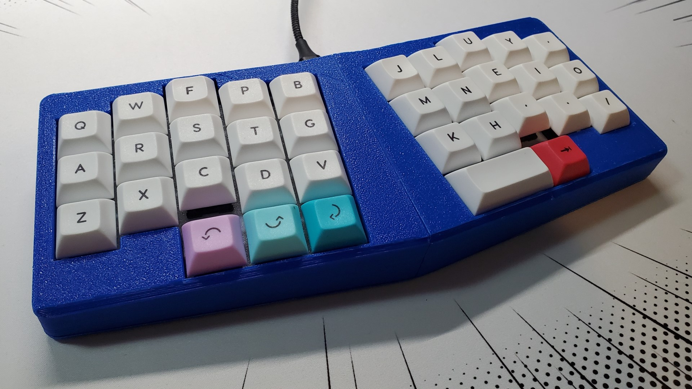
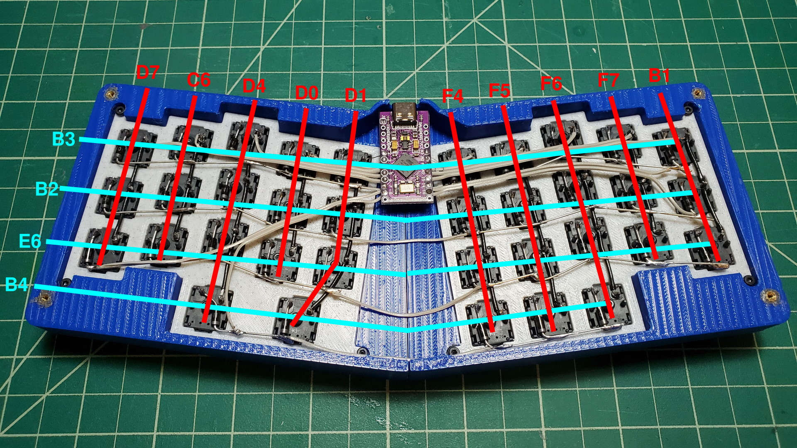

# Type C (like the USB)

A tented columnar staggered handwired keyboard. It has a [Le Chiffre](https://github.com/tominabox1/Le-Chiffre-Keyboard)-ish layout with a 4.5° tenting angle. The case angle is 7° since it reuses the bottom piece of the [new Le Chiffre case](https://github.com/tominabox1/Le-Chiffre-Keyboard/tree/master/Cases/New%20Case).

## Project Structure

The `split` and `nonsplit` folders have STLs for printing based on print bed size. Note the `nonsplit` case is untested.

## Components

| Part                   | Quantity |
| ---------------------- | -------- |
| Keycaps                |          |
| Switches               | 35       |
| Diodes (1N4148/1N4001) | 35       |
| Hookup Wire            |          |
| M2 Screws              | 12       |
| M2 Heat Set Inserts    | 12       |
| 8mm Rubber Bumpons     | 4        |
| Pro Micro or Clone     | 1        |

## Assembly Notes

The case has dual 4mm top mounted plates, designed around [M2x6x3.5mm heat set inserts](https://www.amazon.com/dp/B08ZHCWQ2K). The plate STLs can be flipped horizontally based on bottom row preferences, but the firmware would have to be rewritten accordingly. The Pro Micro can also be hot glued to the top of the case for added stability.

If printing the `split` case, each divided piece is held together with super glue. The top face of the top pieces should also be printed face down on the print bed to save on support material.

## Firmware & Wiring

QMK Firmware files are included as a starting point, but compile and flash the firmware based on your matrix and keymap preferences.

### Wiring/Matrix Diagram

